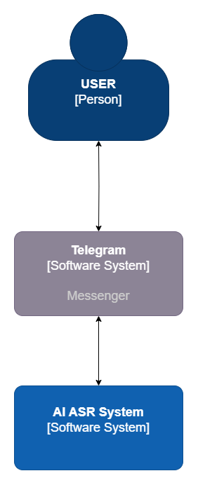
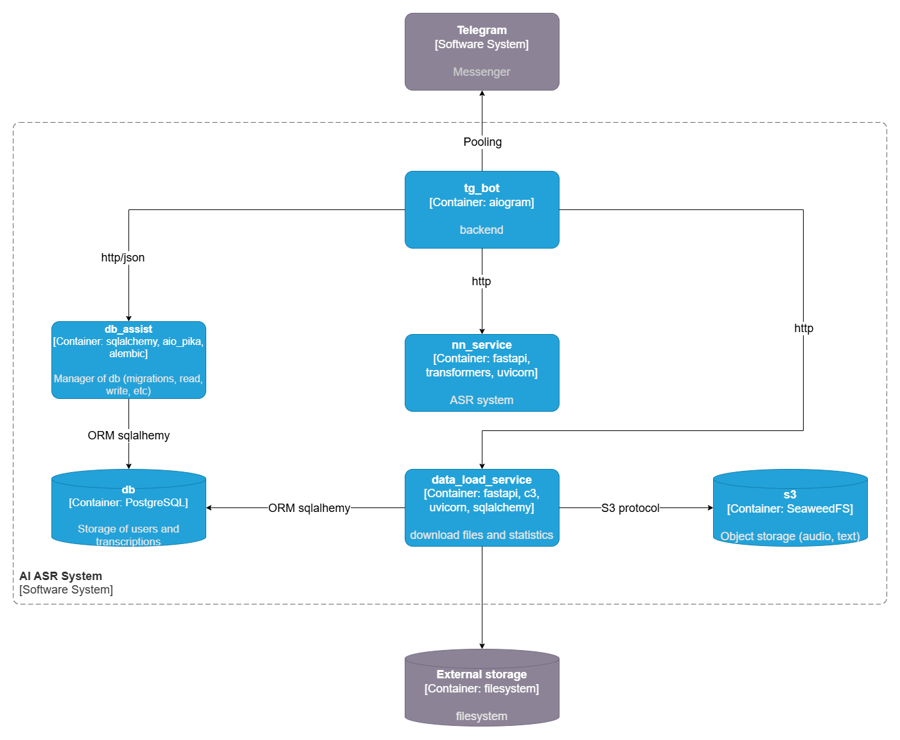
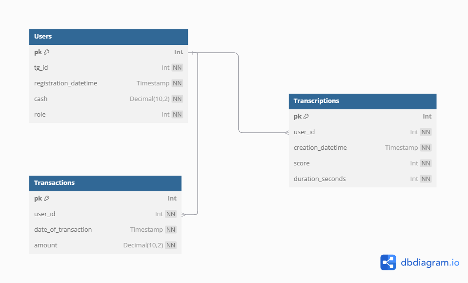

# AI ASR System
Проект, целью которого является распознавание речи и перевод её в текст из аудиосообщений Telegram.  

---
## Назначение проекта
Данный проект задумывался больше как исследовательский и учебный. Хотелось улучшить качество русскоязычной модели за счёт фокуса на
формате аудиосообщений (а не например конференций или интервью).  
Гипотеза в том, что аудиосообщения можно распознавать
с достаточным качеством, даже используя не самые "тяжёлые" модели (whisper-small), натренировав нейросеть на этом домене.
Соответственно, большое внимание уделялось поощрению пользователей отправлять свои аудиосообщения на распознавание для дальнейшего улучшения
качества модели.  

Также, целью было - повысить свои навыки в использовании Docker, Docker Compose, Fast API и системном дизайне.

---
## Запуск
Для запуска важно организовать следующую структуру, необходимо создать пустые директории для монтирования к сервисам и хранения их данных:
```text
ai_asr_system
├── downloads ------------------------------> Папка для хранения данных, загруженных из S3
├── pgdata ---------------------------------> Папка хранения данных Postgres
├── s3_data --------------------------------> Папка хранения данных S3  
├── data_load_service
│   ├── Dockerfile
│   ├── db_module.py
│   ├── requirements.txt
│   ├── run.py
│   ├── s3_module.py
│   └── supervisord.conf
├── db_assist
│   ├── alembic
│   │   ├── README
│   │   ├── env.py
│   │   └── script.py.mako
│   ├── Dockerfile
│   ├── alembic.ini
│   ├── app.py
│   ├── db_actions.py
│   ├── docker-entrypoint.sh
│   ├── models.py
│   └── requirements.txt
├── nn_service
│   ├── __pycache__
│   │   └── api_model.cpython-312.pyc
│   ├── whisper-small-ru/
│   ├── Dockerfile
│   ├── api_model.py
│   └── requirements.txt
├── tg_bot
│   ├── images
│   │   └── cat.png
│   ├── Dockerfile
│   ├── bd_connect_module.py
│   ├── messages_text.py
│   ├── requirements.txt
│   ├── run_bot.py
│   ├── s3_connect_module.py
│   └── transcription_connection_module.py
├── .gitattributes
└── docker-compose.yaml
```

Кроме того, необходимо в корневой директории создать файл `.env` с таким содержимым:
```text
TELEGRAM_TOKEN=<your-telegram-token>

DB_USER=<USERNAME>
DB_PASSWORD=<PASSWORD>
DB_NAME=<DATABASE-NAME>

S3_ACCESS_KEY=<access-key>
S3_SECRET_KEY=<secret-key>
S3_BUCKET_NAME=<buket-name>
```

После этого можно выполнить:

```bash
docker compose up --env-file .env
```
---
## Структура проекта
AI ASR System состоит из следующих частей
1. `tg_bot` - Пингует сервер Telegram. Напрямую взаимодействует с сервисом нейросети. С базой данных и S3 хранилищем через соответствующие сервисы.
2. `nn_service` - Fast API сервис, содержащий в себе дообученную мной на датасете [Common Voice](https://huggingface.co/datasets/mozilla-foundation/common_voice_11_0/viewer/ru?views%5B%5D=ru_train) 
трансформерную модель [whisper-small-ru](https://huggingface.co/Dok-tor/whisper-small-ru). 
Веса модели хранятся в git lfs.
3. `s3` - Локальное S3 хранилище, в данном случае используется `Seaweedfs`.
4. `db` - База данных, которая хранит информацию о пользователях и транскрипциях (`PostgreSQL`).
5. `db_assist` - Fast API модуль, который занимается обслуживанием базы данных (инициализация и миграции). Через него происходит всё взаимодействие сервиса `tg_bot` с базой данных.
6. `data_loader` - Сервис, осуществляющий загрузку в s3 файлов по Fast API запросу и осуществляющий плановую выгрузку файлов по шедулеру.

Верхние 2 уровня [С4 нотации](https://habr.com/ru/companies/nspk/articles/679426/):
<p align="center">
  
</p>
<p align="center">
  
</p>
  
Структура базы данных выглядит следующим образом:  

<p align="center">
  
</p>
Таблица транзакций создавалась с заделом на будущее.

---
## Логика работы проекта
При нажатии пользователем кнопки `start` в Telegram боте, сервис `tg_bot` регистрирует его в базе данных.
При отправке аудиосообщения на распознавание `tg_bot` скачивает аудиофайл с серверов telegram и сконвертировав его с помощью `ffmpeg`,
отправляет на транскрипцию в `nn_service`.  

После получения ответа, сервис бота загружает полученную транскрипцию в s3 через `data_loader` и записывает названия файлов аудиозаписи и транскрипции в базу данных через `db_assist`,
после чего отправляет транскрипцию пользователю.  

В логику `tg_bot` также заложена возможность оценки пользователем качества транскрипции и
начисление пользователю "монет" за вклад в исследование и повышения качества сервиса.

Также `data_loader` раз в несколько часов выгружает добавленные в S3 аудиозаписи и транскрипции в файловую систему в соответствии с оценками пользователей, чтобы потом
можно было дообучать модель на самых "неудачных" случаях.